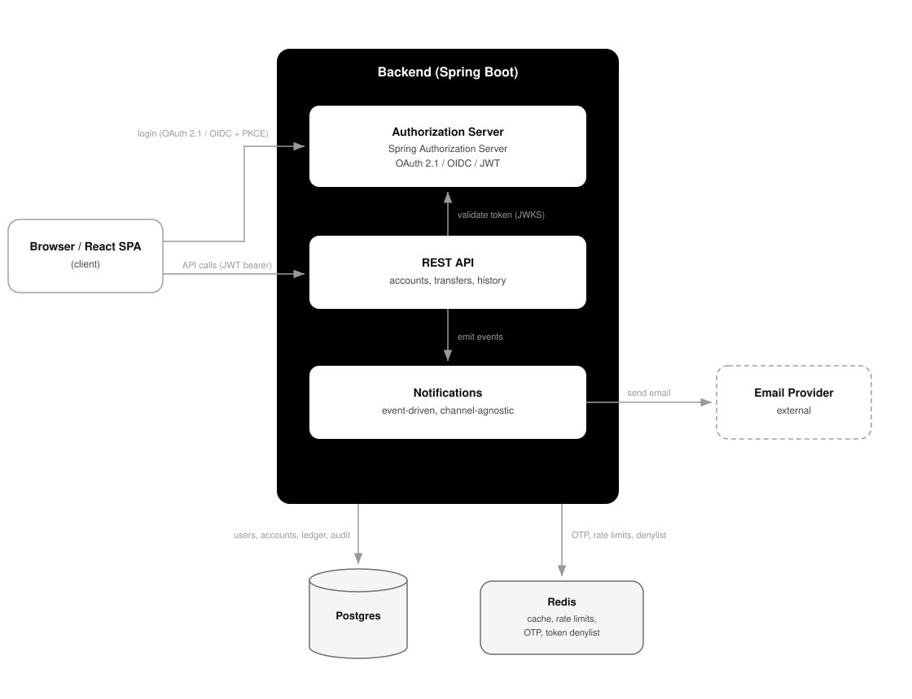
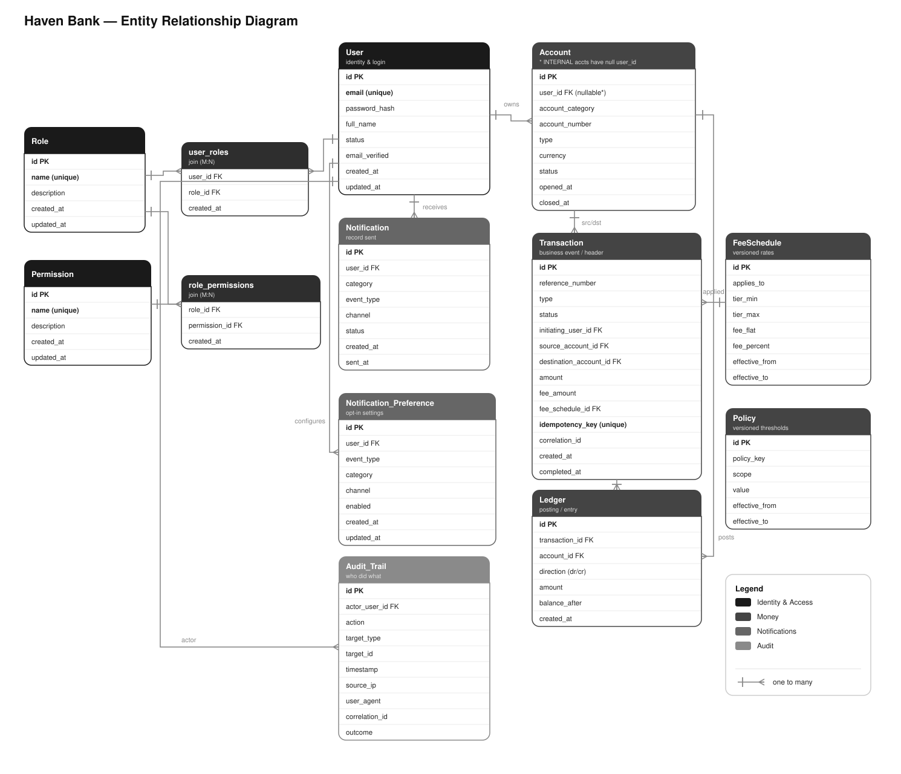

# Haven Bank

Haven Bank is a retail banking web application: customers register, authenticate with multi-factor sign-in, open accounts, move money, and read an auditable transaction history. It has a **self-hosted identity provider**: the backend issues and validates its own tokens and owns authentication, authorization, and all banking logic.

It is a **client–server** application — a **React single-page app** talking to a **Spring Boot backend** over HTTPS. **PostgreSQL** stores users, accounts, the ledger and the audit trail; **Redis** holds ephemeral security state (OTP codes, rate-limit counters, the token denylist).


---

## Table of contents

- [Feature overview](#feature-overview)
- [Tech stack](#tech-stack)
- [Architecture](#architecture)
- [Data model (ERD)](#data-model-erd)
- [Security highlights](#security-highlights)
- [API](#api)
- [Running](#running)
- [Testing](#testing)
- [Onboarding](#onboarding)
- [Repository layout](#repository-layout)
- [Requirements & further docs](#requirements--further-docs)
- [License](#license)

---

## Feature overview

**Identity & access**
- OAuth 2.1 + OIDC authorization server (Spring Authorization Server)
- Authorization Code flow with **PKCE**; short-lived RS256 access tokens, rotating refresh tokens, ID tokens
- **Email OTP** second factor; enumeration-safe registration and password reset
- Progressive login throttling escalating to temporary lockout
- Role-based access control **and** per-record ownership checks
- Logout that revokes the access-token `jti` via a Redis denylist

**Money movement**
- **Double-entry ledger**: every movement is a balanced debit/credit pair committed atomically
- **Idempotency keys** on all mutating money endpoints — a replayed request never double-moves money
- Concurrency-safe balances via database locking (no lost updates under load)
- Fixed-precision decimal arithmetic throughout (no floating point for money)
- Fees, a rolling daily transfer limit, and step-up re-authentication above a configurable threshold
- Balances **derived from the ledger**, never stored as an independently mutable field
- **Saved payees** that prefill a transfer without conferring any authority of their own

**Auditing & observability**
- Append-only security audit trail (actor, action, IP, user agent, correlation id, outcome)
- A correlation id assigned at the edge and propagated across every log line
- Secrets are never logged; account numbers masked to the last four characters

**API protection**
- Tiered rate limiting (strict per-IP on auth endpoints, per-subject elsewhere), Redis-backed
- Security headers (CSP, `X-Content-Type-Options`, `X-Frame-Options`, `Referrer-Policy`), HSTS/TLS
- Structured, non-leaking error responses (RFC 7807)

**Notifications**
- Channel-agnostic dispatch behind a single interface, with email as the delivery channel
- Security-critical notifications are mandatory; convenience notifications are user-configurable
- Asynchronous — a failed notification never rolls back a committed money movement

---

## Tech stack

| Layer | Technology |
|---|---|
| Language / runtime | Java 25 |
| Backend framework | Spring Boot 4.1, Spring Security 7 (OAuth2 resource server) |
| Identity provider | Spring Authorization Server 2.x (OAuth 2.1 + OIDC) |
| Persistence | Spring Data JPA, PostgreSQL 16, Flyway migrations |
| Ephemeral state | Redis 7 (OTP, rate limits, lockout counters, token denylist) |
| Frontend | React 19.2, Vite 8.1, TypeScript 7, React Router 7, `react-oidc-context` / `oidc-client-ts` |
| API docs | OpenAPI / Swagger UI |
| Testing | JUnit, Spring Security Test, Testcontainers (real Postgres + Redis) |
| Delivery | Docker Compose |

---

## Architecture

A two-tier **client–server** design. The **client** is a React SPA. The **server** is a Spring Boot backend that both issues identity (the authorization server) and serves the banking REST API, with PostgreSQL and Redis behind it and email leaving through a dedicated notification component.



### Sign-in flow

1. The SPA calls `signinRedirect()`, sending the browser to `/oauth2/authorize` with PKCE.
2. The user enters their password, then the emailed OTP, on the server's own pages — the SPA never sees either.
3. The server redirects back to `/oauth/callback` with a code, which `oidc-client-ts` exchanges at `/oauth2/token` for access, refresh and ID tokens.
4. Subsequent calls to `/api/v1/*` carry the access token as a bearer.

---

## Data model (ERD)

The PostgreSQL schema below is in four groups — **identity & access**, **money**, **notifications**, and **audit**. Ephemeral security state (OTP codes, email-verification and password-reset tokens, rate-limit and lockout counters, the access-token denylist) lives in **Redis with TTLs** and is not part of the relational model.



A few deliberate details: **`ACCOUNT.user_id` is nullable** — internal accounts (e.g. the bank's fee-income account) have no owner, which is how fees post cleanly inside the double-entry model. **`AUDIT_TRAIL` is append-only.** **`FEE_SCHEDULE` and `POLICY` are versioned** (effective-dated rows, never updated in place), so past postings stay reproducible; `POLICY` intentionally has no foreign keys — it's read by the application.

---

## Security highlights

This is a banking app, so security is the headline rather than a footnote.

- **Passwords** stored as BCrypt hashes carrying Spring's algorithm prefix (`{bcrypt}$2a$…`), never plaintext. Because each hash records the algorithm that produced it, a stronger one such as Argon2id can be adopted later without a forced password reset — new passwords use it immediately, and existing hashes are upgraded silently on the user's next successful login.
- **Tokens** are asymmetrically signed (RS256); the API validates signature, issuer, audience *and* expiry against the published JWKS endpoint. `alg: none` and algorithm-confusion are handled by the library, not by hand-rolled parsing.
- **Customers can only reach their own data.** Every account, balance and transaction lookup filters by the logged-in user's id, so asking for someone else's account returns `404`. This is the IDOR flaw (broken object-level authorization), OWASP's top API risk.
- **Tokens never persist in the browser.** Access tokens live only in the running page's memory and the refresh token in an `HttpOnly`, `Secure`, `SameSite` cookie — never in `localStorage` or `sessionStorage`, which any injected script can read. The only value in browser storage is the transient PKCE `code_verifier`, which has to survive the redirect. The trade-off is that a hard refresh drops the session and the user signs in again.
- **Saving a payee does not confirm the account exists.** Rejecting an unknown account number here would be the obvious behaviour and the wrong one: it turns the endpoint into an account-enumeration oracle, letting any signed-in user walk the number space and learn which accounts are real. A saved payee is treated as an address-book entry — shape validated, existence not — and the account is resolved at transfer time, where the check is already rate limited, audited and returns a deliberately non-leaking error. The consequence is that a saved payee grants nothing; it fills in a form, and the transfer runs every ownership, balance, limit and step-up check it would have run had the number been typed by hand.
- **Segregation of duties** baked into the roles: Staff can see data but not move money; Admin manages users but cannot see balances.
- **Step-up authentication** (a fresh OTP) for high-value transfers, independent of session validity.
- **Secrets never leak** into logs, audit records, notifications, or API responses.

---

## API

The full, always-current contract is served from **Swagger UI at `/swagger-ui.html`** (OpenAPI spec at `/v3/api-docs`).

### Response & status-code conventions

Controllers follow one rule, applied uniformly so that endpoints of the same shape look the same. A reviewer should treat a deviation as a defect, not a style choice.

1. **Success with a body, default status** → return the DTO directly. Spring serialises it as `200 OK`. Do **not** wrap it in `ResponseEntity` — the wrapper changes nothing about the body or headers and only adds noise.
2. **Success that needs a non-default status or a header** → return `ResponseEntity`. This is the *only* reason to use it: `201 Created` on resource creation (deposit/withdraw/transfer, open account, add beneficiary, create role/fee/policy), `202 Accepted` on enumeration-safe async endpoints (register, forgot-password), `204 No Content` on no-body success (verify, lock/unlock/deactivate, logout, password change), or a custom header (e.g. `Content-Disposition` on statement download).
3. **Failure** → never build an error response in a controller. Throw a domain exception (`BusinessException`, `ResourceNotFoundException`) or let bean-validation fail; `GlobalExceptionHandler` (`@RestControllerAdvice`) maps it to an RFC 7807 `ProblemDetail` with the correct status. This keeps error shape uniform across every endpoint and keeps internal detail off the wire (NFR-5.4).

**Status codes are always the `HttpStatus` enum, never numeric literals** — `ResponseEntity.status(HttpStatus.CREATED)`, not `ResponseEntity.status(201)`. The enum is self-documenting and greppable; magic numbers are neither.

Consistency is *within* a category, not across categories: a `200`-with-body endpoint and a `204`-no-body endpoint are different operations and their signatures should differ — that difference is information, not inconsistency. The genuine smell to catch in review is two same-shaped endpoints handled differently (e.g. one creation returning `201` and another returning `200`).

**Registration & credentials**

| Method | Path | Auth | Notes |
|---|---|---|---|
| POST | `/api/v1/register` | public | `202` always (enumeration-safe) |
| POST | `/api/v1/register/verify` | public | `204`; activates account, sends account-created email |
| POST | `/api/v1/password/change` | JWT | verifies current password; security notification |
| POST | `/api/v1/password/forgot` | public | `202` always |
| POST | `/api/v1/password/reset` | public | single-use token |
| GET | `/api/v1/me` | JWT | own profile only |

**Authorization server (interactive + protocol)**

| Path | Purpose |
|---|---|
| `GET /oauth2/authorize` | start Auth Code + PKCE; renders login → OTP |
| `POST /oauth2/token` | code → access/refresh/ID tokens; refresh rotation |
| `GET /oauth2/jwks` · `/.well-known/openid-configuration` | keys + discovery |
| `GET /userinfo` | OIDC profile |
| `GET /login`, `GET/POST /login/otp` | password step, then email-OTP step |

**Money** — all require `hasRole('CUSTOMER')`; movements require an `Idempotency-Key` header

| Method | Path | Notes |
|---|---|---|
| GET/POST | `/api/v1/accounts` | list own / open |
| GET/POST | `/api/v1/accounts/{id}` · `/close` | get (not owned → `404`) / close (zero balance) |
| POST | `/api/v1/accounts/{id}/deposit` · `/withdraw` | double-entry, idempotent |
| POST | `/api/v1/transfers` | fees, daily limit, step-up above threshold |
| GET/POST | `/api/v1/beneficiaries` | list own saved payees / add (`409` on duplicate) |
| PUT/DELETE | `/api/v1/beneficiaries/{id}` | rename / remove (not owned → `404`) |
| GET | `/api/v1/accounts/{id}/transactions` | paginated history |
| POST | `/api/v1/auth/otp/challenge` · `/verify` | step-up OTP |
| GET/PUT | `/api/v1/me/notification-preferences` | convenience opt-in/out |

**Administration** — `hasRole('ADMIN')`, except audit reads which also allow `STAFF`

| Method | Path | Notes |
|---|---|---|
| GET/POST | `/api/v1/admin/roles` · `GET /permissions` | list/create roles; list permissions |
| PUT/DELETE | `/api/v1/admin/roles/{id}` · `PUT /{id}/permissions` | update/delete (`409` if assigned); set permissions |
| GET | `/api/v1/admin/users` · `/{id}` | paginated / single |
| PUT/POST | `/api/v1/admin/users/{id}/roles` · `/lock` · `/unlock` · `/deactivate` | assign roles; soft state changes |
| GET | `/api/v1/admin/audit` · `/{id}` | read-only trail (STAFF or ADMIN); reads are audited |
| GET/POST | `/api/v1/admin/fee-schedules` · `/policies` | versioned fee and policy admin |

**Frontend routes**

| Route | Purpose |
|---|---|
| `/` | Landing and sign in |
| `/register` · `/verify-email?token=` | Open an account, then activate it |
| `/forgot-password` · `/reset-password?token=` | Request and complete a password reset |
| `/oauth/callback` | PKCE code exchange |
| `/profile` · `/change-password` | Own profile and password change — protected |
| `/dashboard` · `/accounts/:id` · `/transfer` | Accounts, history and money movement (step-up aware) — protected |
| `/beneficiaries` | Saved payees: list and add — protected |
| `/preferences` | Notification opt-in/out — protected |
| `/admin/users` · `/roles` · `/audit` · `/policies` | Administration — role-gated (ADMIN; audit also STAFF) |

---

## Running

Requires JDK 25 and Docker. The backend serves both the API and the authorization server on `:8080`.

### With Docker Compose (recommended)

```bash
cd backend
docker compose up --build      # Postgres + Redis + the app on :8080
```

### Without Docker Compose

```bash
# 1. Start Postgres + Redis
docker run -d --name pg -e POSTGRES_DB=banking -e POSTGRES_USER=banking \
  -e POSTGRES_PASSWORD=banking -p 5432:5432 postgres:16
docker run -d --name redis -p 6379:6379 redis:7

# 2. (optional) override the issuer / SPA redirect if not using defaults
export APP_ISSUER=http://localhost:8080
export APP_SPA_REDIRECT_URI=http://localhost:5173/oauth/callback

# 3. Run
cd backend && ./mvnw spring-boot:run
```

Flyway applies `V1__iam_schema.sql` on startup (tables, plus seeded CUSTOMER/STAFF/ADMIN roles).
Swagger UI is then at http://localhost:8080/swagger-ui.html.

### Frontend

```bash
cd ui
cp .env.example .env      # adjust if the backend isn't on localhost:8080
npm install
npm run dev               # http://localhost:5173
```

The backend must be running on `:8080` with CORS allowing `http://localhost:5173` (configured via `app.cors.allowed-origins`).

---

## Testing

```bash
cd backend && ./mvnw test
```

Unit tests over the security-critical logic, using JUnit 5, Mockito and AssertJ. No infrastructure
required — they run without Postgres or Redis.

**Token validation**
- `AudienceValidatorTest` — accepts a token issued for this API, rejects one issued for another and one with no `aud` at all.
- `DenylistJwtValidatorTest` — a token whose `jti` was denylisted at logout is refused before it expires.
- `TokenDenylistTest` — revoked ids are stored only for the token's remaining lifetime; nothing is stored forever.

**Authentication**
- `OtpServiceTest` — the login code is single-use, six digits, never returned to the caller, and the challenge is burned once the attempt limit is passed.
- `LoginAttemptServiceTest` — failures below the threshold don't lock; beyond it the lock doubles each time and is capped, so an attacker cannot lock someone out indefinitely.
- `StepUpServiceTest` — a high-value transfer needs a fresh code, and the resulting elevation is single-use.

**Protection and confidentiality**
- `RateLimiterTest` — tier limits hold, repeat offenders get an escalating block, and on a Redis outage authentication fails closed while reads fail open.
- `CryptoConverterTest` — AES-GCM round-trips, ciphertext differs on every write, and tampering is rejected.

**Domain**
- `RegistrationServiceTest` — only a hash is stored, accounts start inactive, and registering an already-taken email is silently indistinguishable from success.
- `PasswordServiceTest` — a change requires the current password, a reset token is single-use, and a forgotten-password request for an unknown address behaves identically to a known one.
- `FeeServiceTest` · `PolicyServiceTest` — fees and thresholds come from effective-dated rows, in fixed-precision decimal.
- `PreferenceGateTest` — security-critical notifications cannot be suppressed; convenience ones honour the user's choice.

**Not yet written:** the end-to-end integration tests — cross-customer access returning `404`,
idempotency replay, and concurrent-transfer correctness — which need Testcontainers to run against a
real Postgres and Redis.

---

---

## Onboarding

Anyone can open an account with an email address, a password and a name — the digital-first model
used by Monzo, Starling and Revolut. Established banks work the other way round: you become a
customer in a branch or through an application, staff or a KYC pipeline create the record, and what
looks like registration is really **enrolment** — proving you are already a customer using an
account number, card details and date of birth, often with an activation code sent by post.

The difference is regulatory rather than technical. A bank cannot open a customer relationship from
an email address: customer due diligence, sanctions and PEP screening all have to happen first.
Even the digital-first banks gate signup behind photo ID and a liveness check. This project stops
short of identity verification, so treat registration as the step that would follow it.

**Registering an address that already has an account still sends mail** — a notice to the existing
owner rather than a verification link. Both paths behave identically from outside, so the response
cannot be used to discover which addresses hold accounts (FR-1.7), while the real owner learns
someone tried. The alternative — an explicit "this email is taken" error — is an enumeration oracle:
feed it a list and the errors mark out real customers.

## Repository layout

```
haven-bank/
├── README.md
├── LICENSE
├── .gitignore
├── backend/                              ← Spring Boot server (REST API + authorization server)
│   ├── pom.xml
│   ├── Dockerfile · docker-compose.yml
│   └── src/
│       ├── main/java/com/havenbank/backend/
│       │   ├── iam/                       ← users, roles, permissions, registration, passwords
│       │   ├── authserver/                ← OAuth 2.1 / OIDC provider, login and email OTP
│       │   ├── money/                     ← accounts, ledger, transactions, fees, policy
│       │   ├── notification/              ← notifications and per-user preferences
│       │   ├── audit/                     ← append-only audit trail
│       │   └── shared/                    ← crypto, error handling, rate limiting, web infra
│       ├── main/resources/
│       │   ├── application.yaml
│       │   ├── db/migration/              ← Flyway schema migrations
│       │   └── templates/ · static/       ← server-rendered login and OTP pages
│       └── test/java/com/havenbank/backend/
├── ui/                                   ← React SPA (client)
│   ├── package.json
│   ├── vite.config.ts · tsconfig.json · index.html
│   ├── .env.example                       ← OIDC authority, client id, redirect URI, API base
│   └── src/
│       ├── main.tsx · App.tsx · styles.css
│       ├── auth/                          ← OIDC config, route guards, roles claim
│       ├── api/                           ← fetch wrapper and response types
│       ├── components/ · lib/             ← layout, splash, money formatting
│       └── pages/                         ← routes, including admin/
└── docs/
    ├── requirements.md
    ├── architecture.drawio · architecture.svg
    └── erd.drawio · erd.svg
```

Code is organised **by feature first, then by layer**: each feature package contains its own
`controller`, `service`, `repository`, `domain` and `dto` sub-packages, so a change to money
movement touches one directory rather than five. `shared` is the exception — it holds cross-cutting
infrastructure grouped by concern (`crypto`, `error`, `ratelimit`, `security`, `web`, `openapi`).

---

## Requirements & further docs

The full requirements specification (functional + non-functional, with priorities and design notes) lives at **[`docs/requirements.md`](docs/requirements.md)**.

---

## License

MIT — see [`LICENSE`](LICENSE).
